# King's Cooking - Product Requirements Document
*Custom Chess Variant with WebRTC Multiplayer*

**Document Version:** 1.0
**Last Updated:** 2025-01-27
**Status:** Draft

---

## 1. Executive Summary

### Vision Statement
Create the most innovative and engaging chess variant experience that combines strategic gameplay with social connection, built entirely in the browser with zero server dependencies.

### Product Overview
**King's Cooking** is a revolutionary chess variant that transforms traditional competitive chess into a collaborative party-planning experience. Players compete to send opponent pieces to their king's castle to help prepare the ultimate feast, with the king hosting the most guests declared the winner.

### Key Differentiators
- **Unique Victory Condition**: Party hosting instead of checkmate
- **Variable Board Sizes**: Customizable game dimensions
- **Three Setup Modes**: Random, Mirrored, and Independent piece selection
- **Zero Infrastructure**: Pure WebRTC peer-to-peer multiplayer
- **Static Deployment**: GitHub Pages hosting with no ongoing costs
- **Cross-Platform**: Works on all modern browsers and devices

### Success Metrics
- **Technical**: 80%+ test coverage, <3s load time, 99% uptime
- **Engagement**: 15+ minute average session, 70% completion rate
- **Quality**: <5% connection failure rate, seamless cross-browser experience

---

## 2. Problem & Solution

### Current Market Gaps

Based on market research of existing chess variant platforms:

**Chess.com**: Limited to predefined variants, requires account creation, closed ecosystem
**PyChess**: Open source but limited variant selection, dated UI/UX
**Multiplayer Chess**: Generic variants, lacks unique game mechanics
**Browser Games**: Most require servers, have scaling limitations, ongoing hosting costs

### The King's Cooking Solution

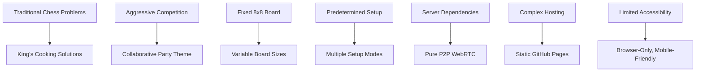

### Target User Personas

#### Primary: The Social Strategist
- **Age**: 25-45
- **Background**: Enjoys chess but finds traditional games too serious
- **Goals**: Fun, social gaming experiences with friends
- **Pain Points**: Limited time, wants quick setup, mobile-friendly
- **Motivations**: Social connection, unique experiences, easy sharing

#### Secondary: The Chess Innovator
- **Age**: 18-65
- **Background**: Chess enthusiast seeking new challenges
- **Goals**: Master new variants, explore strategic depth
- **Pain Points**: Bored with standard chess, wants fresh mechanics
- **Motivations**: Strategic mastery, novelty, teaching others

#### Tertiary: The Casual Gamer
- **Age**: 16-50
- **Background**: Enjoys simple, accessible games
- **Goals**: Quick entertainment, social interaction
- **Pain Points**: Complex setup, lengthy games
- **Motivations**: Immediate fun, easy learning curve

---

## 3. Detailed Game Mechanics

### 3.1 Core Game Rules

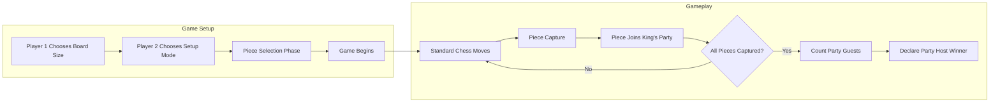

### 3.2 Board Size Selection

**Player 1 Options**:
- Minimum: 4x4 board
- Maximum: 12x12 board
- Default suggestion: 6x6 or 8x6 for balanced gameplay
- UI: Slider with real-time preview

### 3.3 Setup Modes Detail

#### Random Mode
```typescript
interface RandomSetup {
  pawnChance: number; // Default 50%, adjustable
  pieceDistribution: {
    queen: 1;    // Maximum 1
    rook: 2;     // Maximum 2
    bishop: 2;   // Maximum 2
    knight: 2;   // Maximum 2
    pawn: number; // Fill remaining slots
  };
  algorithm: 'weighted-random'; // Probability adjusts after each draw
}
```

#### Playground Mirrored Mode
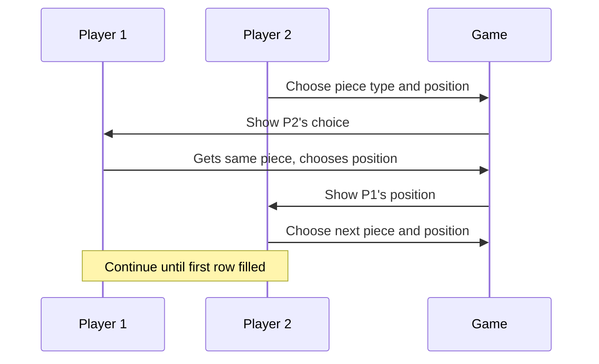

#### Playground Independent Mode
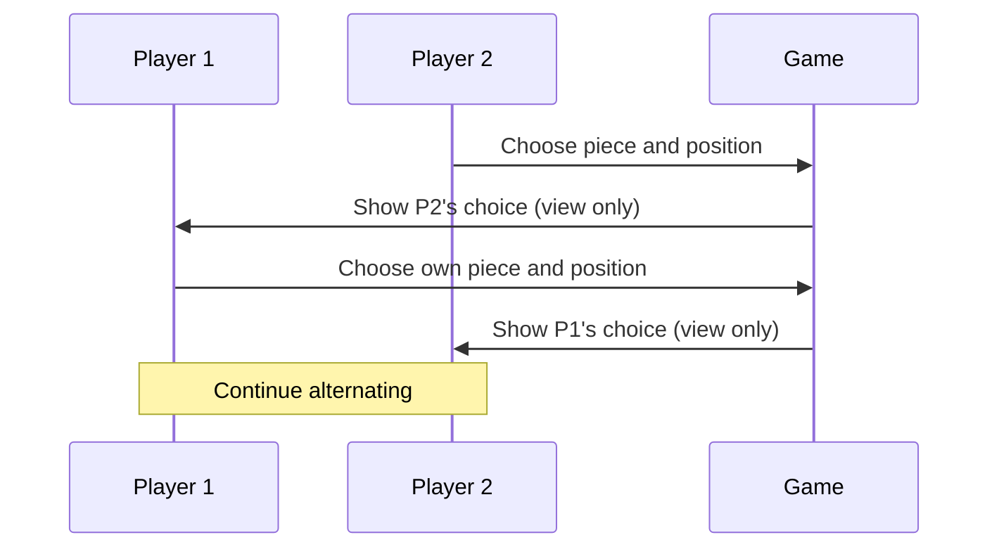

### 3.4 Victory Conditions

**Party Metric Calculation**:
```typescript
interface PartyScore {
  kingLocation: 'white' | 'black';
  guestPieces: CapturedPiece[];
  totalValue: number; // Sum of piece values from opponent
  winCondition: 'most_guests' | 'first_to_threshold';
}

// King with the MOST opponent pieces at their castle wins
function determineWinner(whiteKingGuests: number, blackKingGuests: number): Winner {
  if (whiteKingGuests > blackKingGuests) return 'white_hosts_party';
  if (blackKingGuests > whiteKingGuests) return 'black_hosts_party';
  return 'tie_no_party'; // Rare edge case
}
```

### 3.5 Off-Board Movement Rules

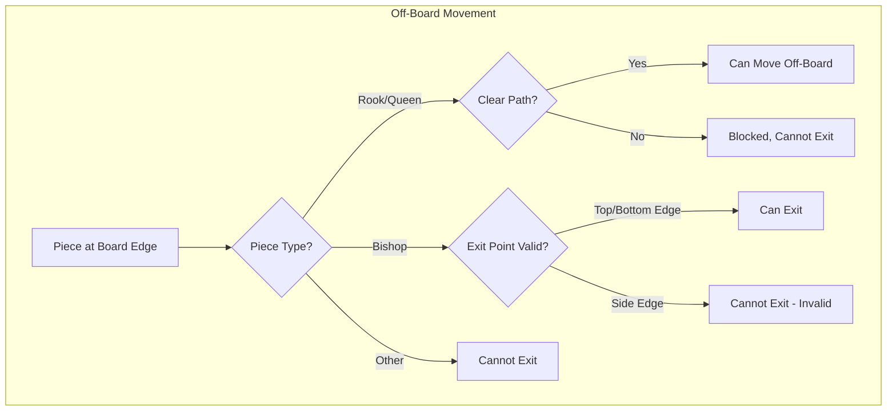

**Visual Diagram Needed**: Board layout showing valid/invalid exit points for different pieces.

---

## 4. Technical Architecture

### 4.1 High-Level System Design

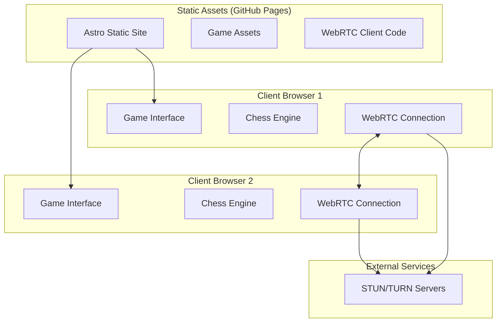

### 4.2 Islands Architecture Implementation

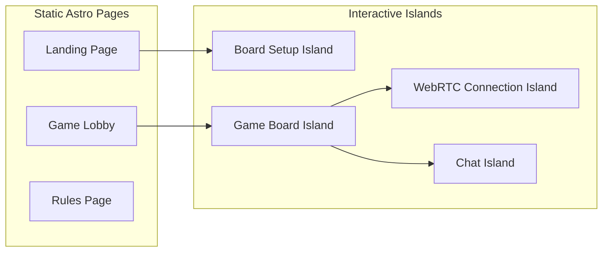

**Hydration Strategy**:
- **client:load**: Critical game state components
- **client:visible**: Secondary UI elements
- **client:idle**: Background connection management

### 4.3 Data Flow Architecture

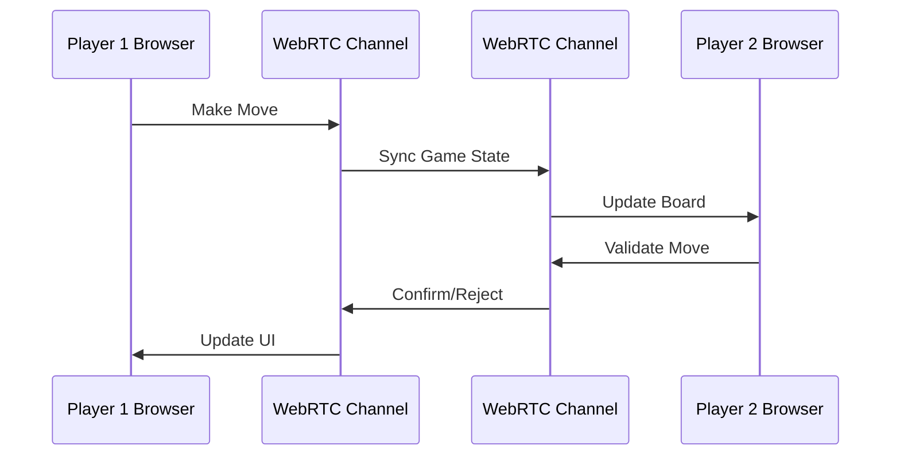

### 4.4 WebRTC Implementation Strategy

Based on research findings, we'll use a **hybrid architecture**:

```typescript
interface WebRTCGameConnection {
  // Connection Management
  peerConnection: RTCPeerConnection;
  dataChannel: RTCDataChannel;

  // Game State Sync
  sendGameState(state: GameState): void;
  receiveGameState(callback: (state: GameState) => void): void;

  // Connection Quality
  getConnectionStats(): ConnectionQuality;
  handleReconnection(): Promise<boolean>;
}

// Message Protocol
interface GameMessage {
  type: 'move' | 'state_sync' | 'setup' | 'chat' | 'connection_test';
  payload: any;
  timestamp: number;
  messageId: string;
}
```

**Infrastructure Requirements**:
- **STUN Servers**: Use public Google STUN servers for NAT traversal
- **TURN Servers**: Implement fallback with free tier services (Xirsys/Twilio)
- **Signaling**: Use Firebase Realtime Database or similar for initial connection

---

## 5. User Experience Design

### 5.1 User Flow Diagrams

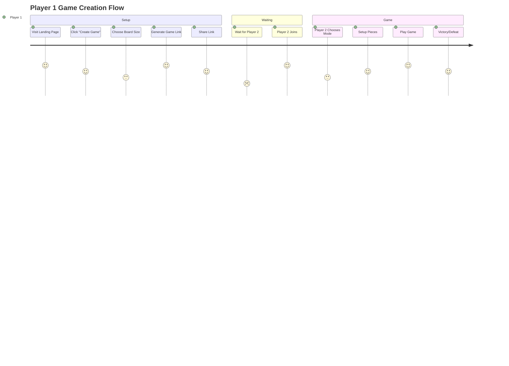

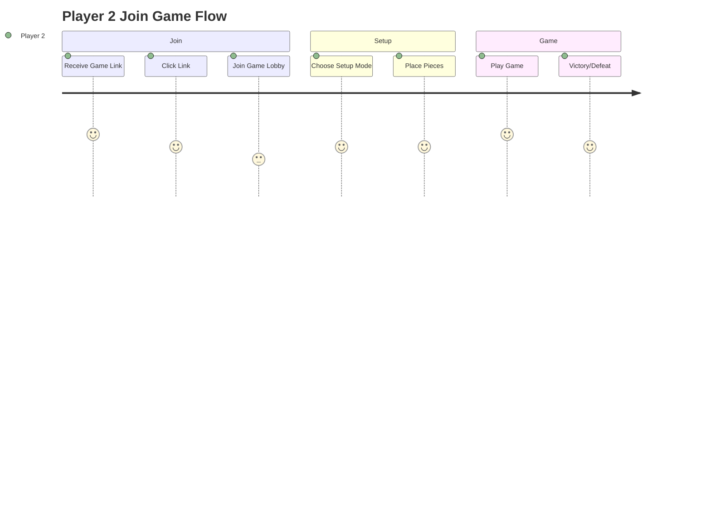

### 5.2 Wireframe Specifications

#### Landing Page Layout
```
┌─────────────────────────────────────┐
│              🍳 King's Cooking      │
│         The Party Planning Chess   │
├─────────────────────────────────────┤
│  [Create Game] [Join Game] [Rules]  │
├─────────────────────────────────────┤
│            Game Preview             │
│         (Animated Board)            │
├─────────────────────────────────────┤
│        How to Play (3 steps)       │
└─────────────────────────────────────┘
```

#### Game Setup Interface
```
┌─────────────────────────────────────┐
│         Board Size: [6x6] ⚙️        │
├─────────────────────────────────────┤
│                                     │
│         🏰     BOARD     🏰         │
│         👑              👑         │
│                                     │
├─────────────────────────────────────┤
│  Setup Mode: [Random] [Mirror] [Free] │
├─────────────────────────────────────┤
│     [Share Link] [Start Game]       │
└─────────────────────────────────────┘
```

### 5.3 Mobile Responsiveness

**Breakpoints**:
- **Desktop**: 1024px+ (Full sidebar layout)
- **Tablet**: 768px-1023px (Collapsible sidebar)
- **Mobile**: <768px (Stack layout, touch-optimized)

**Touch Interactions**:
- Drag & drop for piece movement
- Tap to select, tap to move alternative
- Pinch to zoom for large boards
- Swipe gestures for UI navigation

---

## 6. API Specifications

### 6.1 Game State Management

```typescript
// Core Game State Interface
interface GameState {
  gameId: string;
  board: Board;
  currentPlayer: PlayerId;
  phase: GamePhase;
  setup: GameSetup;
  capturedPieces: CapturedPieces;
  moveHistory: Move[];
  gameResult?: GameResult;
  timestamp: number;
}

interface Board {
  dimensions: { width: number; height: number };
  squares: (Piece | null)[][];
}

interface Piece {
  type: PieceType;
  color: PlayerColor;
  position: Position;
  moveCount: number;
}

type PieceType = 'pawn' | 'rook' | 'knight' | 'bishop' | 'queen';
type PlayerColor = 'white' | 'black';
type GamePhase = 'setup' | 'piece_selection' | 'playing' | 'finished';

interface Move {
  from: Position;
  to: Position | 'off_board';
  piece: Piece;
  captured?: Piece;
  timestamp: number;
  valid: boolean;
}
```

### 6.2 WebRTC Message Protocol

```typescript
// Message Types
type MessageType =
  | 'connection_request'
  | 'connection_accept'
  | 'game_state_sync'
  | 'move_request'
  | 'move_response'
  | 'setup_choice'
  | 'chat_message'
  | 'ping'
  | 'error';

interface BaseMessage {
  type: MessageType;
  messageId: string;
  timestamp: number;
  senderId: PlayerId;
}

interface MoveRequestMessage extends BaseMessage {
  type: 'move_request';
  move: Move;
  gameState: GameState;
}

interface MoveResponseMessage extends BaseMessage {
  type: 'move_response';
  moveId: string;
  valid: boolean;
  reason?: string;
  updatedState?: GameState;
}
```

### 6.3 Chess Engine API

```typescript
class ChessEngine {
  // Move Validation
  isValidMove(from: Position, to: Position, board: Board): boolean;
  getValidMoves(piece: Piece, board: Board): Position[];

  // Special Rules
  canCaptureEnPassant(move: Move, gameState: GameState): boolean;
  canMoveOffBoard(piece: Piece, position: Position, board: Board): boolean;

  // Game State
  calculateGameResult(gameState: GameState): GameResult | null;
  countPartyGuests(color: PlayerColor, gameState: GameState): number;

  // Setup Validation
  isValidSetup(setup: PieceSetup, boardSize: BoardDimensions): boolean;
  generateRandomSetup(boardSize: BoardDimensions, options: RandomOptions): PieceSetup;
}
```

---

## 7. Data Models

### 7.1 Database Schema (Local Storage)

```typescript
// Local Storage Schema for Game Persistence
interface StoredGameData {
  gameId: string;
  created: Date;
  lastAccessed: Date;
  gameState: GameState;
  connectionInfo: ConnectionMetadata;
  playerRole: 'host' | 'guest';
}

interface ConnectionMetadata {
  peerId: string;
  signalServerUsed: string;
  stunServersUsed: string[];
  turnServerUsed?: string;
  connectionQuality: ConnectionQuality;
}

interface GameHistory {
  games: StoredGameData[];
  stats: PlayerStats;
  preferences: UserPreferences;
}
```

### 7.2 State Machine Design

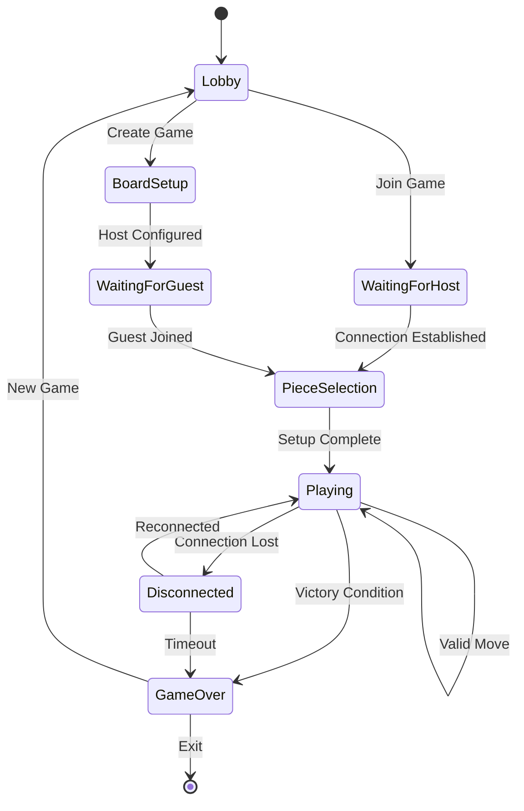

---

## 8. Implementation Phases

### Phase 1: Foundation (MVP) - 2-3 weeks
**Goal**: Basic playable game with core mechanics

**Features**:
- Static board (8x6 default size)
- Random piece setup only
- Basic WebRTC connection
- Core chess movement rules
- Victory condition detection
- Simple UI/UX

**Success Criteria**:
- Two players can connect and play a complete game
- All piece movements work correctly
- Victory condition calculates properly
- Deployed to GitHub Pages

### Phase 2: Enhanced Setup - 1-2 weeks
**Goal**: Full setup customization options

**Features**:
- Variable board sizes (4x4 to 12x12)
- All three setup modes (Random, Mirrored, Independent)
- Improved piece selection UI
- Setup mode tutorials
- Enhanced mobile responsiveness

**Success Criteria**:
- All setup modes working flawlessly
- Intuitive piece selection interface
- Responsive design on all devices

### Phase 3: Experience Polish - 1-2 weeks
**Goal**: Production-ready user experience

**Features**:
- Game reconnection handling
- Chat functionality
- Move history and replay
- Game statistics tracking
- Sound effects and animations
- Comprehensive error handling

**Success Criteria**:
- < 5% connection failure rate
- Smooth animations and feedback
- Robust error recovery

### Phase 4: Advanced Features - 2-3 weeks
**Goal**: Competitive and social features

**Features**:
- Spectator mode
- Game recording and sharing
- Advanced statistics
- Tutorial system
- Accessibility improvements
- Performance optimizations

**Success Criteria**:
- Sub 3-second load times
- Full accessibility compliance
- Rich sharing capabilities

---

## 9. Risk Assessment & Mitigation

### 9.1 Technical Risks

| Risk | Probability | Impact | Mitigation Strategy |
|------|-------------|---------|-------------------|
| WebRTC Connection Failures | Medium | High | Robust TURN fallback, connection retry logic, clear error messages |
| NAT Traversal Issues | Medium | High | Multiple STUN/TURN providers, connection testing, fallback methods |
| Cross-Browser Compatibility | Low | Medium | Comprehensive testing, progressive enhancement, polyfills |
| GitHub Pages Limitations | Low | Medium | Static-first architecture, CDN for assets, monitoring |
| State Synchronization Bugs | Medium | High | Comprehensive testing, state validation, rollback mechanisms |

### 9.2 Product Risks

| Risk | Probability | Impact | Mitigation Strategy |
|------|-------------|---------|-------------------|
| Complex Rules Confusion | Medium | Medium | Interactive tutorials, clear documentation, progressive disclosure |
| Limited Market Appeal | Low | High | User testing, feedback collection, iterative improvement |
| Performance on Mobile | Medium | Medium | Progressive enhancement, performance testing, optimization |
| Cheating/Exploitation | Low | Medium | Client-side validation, move verification, fair play detection |

### 9.3 Business Risks

| Risk | Probability | Impact | Mitigation Strategy |
|------|-------------|---------|-------------------|
| Hosting Costs | Very Low | Low | Static hosting = zero ongoing costs |
| Legal/IP Issues | Very Low | Medium | Original game mechanics, open source components |
| Scaling Limitations | Low | Medium | P2P architecture scales naturally |

---

## 10. Success Metrics & KPIs

### 10.1 Technical Metrics

**Performance**:
- Page load time: < 3 seconds (target < 2s)
- Time to interactive: < 5 seconds
- Bundle size: < 2MB total
- Lighthouse score: > 90

**Reliability**:
- WebRTC connection success rate: > 95%
- Game completion rate: > 80%
- Error rate: < 2%
- Cross-browser compatibility: 100% on modern browsers

**Quality**:
- Test coverage: > 80%
- Zero critical bugs in production
- Mobile performance parity: > 95%

### 10.2 User Experience Metrics

**Engagement**:
- Average session duration: > 15 minutes
- Game completion rate: > 70%
- Return usage within 7 days: > 40%

**Usability**:
- Setup completion rate: > 85%
- Time to first move: < 2 minutes
- Help documentation usage: < 10% (indicating intuitive design)

**Satisfaction**:
- User feedback score: > 4.0/5.0
- Feature request vs bug report ratio: > 3:1

### 10.3 Adoption Metrics

**Growth**:
- Monthly active users (target growth)
- Viral coefficient: > 1.2 (average invites per user)
- Social sharing rate: > 15%

**Retention**:
- Day 1 retention: > 60%
- Day 7 retention: > 30%
- Day 30 retention: > 15%

---

## 11. Accessibility & Compliance

### 11.1 WCAG 2.1 AA Compliance

**Visual Accessibility**:
- High contrast mode support
- Scalable text (up to 200%)
- Alternative color indicators for colorblind users
- Screen reader compatibility

**Motor Accessibility**:
- Keyboard navigation for all game functions
- Large touch targets (44px minimum)
- Gesture alternatives
- Reduced motion options

**Cognitive Accessibility**:
- Clear, simple language
- Consistent navigation patterns
- Timeout warnings and extensions
- Progressive disclosure of complex features

### 11.2 International Support

**Localization Ready**:
- Internationalization (i18n) framework
- Separable text content
- RTL language support structure
- Cultural sensitivity in game themes

---

## 12. Appendices

### Appendix A: Competitive Analysis Detail

| Platform | Strengths | Weaknesses | Lessons |
|----------|-----------|------------|---------|
| Chess.com | Massive user base, robust features | Closed ecosystem, generic variants | Focus on unique mechanics |
| PyChess | Open source, multiple variants | Dated UI, limited mobile | Modern design is crucial |
| Lichess | Fast, lightweight, free | Traditional focus | Performance matters |

### Appendix B: Technical Dependencies

**Core Dependencies**:
```json
{
  "astro": "^5.0.0",
  "typescript": "^5.6.0",
  "@astrojs/tailwind": "^5.1.0"
}
```

**WebRTC Libraries**:
- Simple-peer for WebRTC abstraction
- Socket.io-client for signaling fallback
- StunTurn for ICE server management

### Appendix C: Visual Design System

**Color Palette**:
- Primary: #8B4513 (Saddle Brown - cooking theme)
- Secondary: #DAA520 (Goldenrod - royal theme)
- Accent: #FF6347 (Tomato - energy/action)
- Neutral: #F5F5DC (Beige - board background)

**Typography**:
- Headings: Inter/System Font
- Body: Inter/System Font
- Monospace: JetBrains Mono (for coordinates)

**Component Patterns**:
- Card-based layouts
- Floating action buttons
- Contextual menus
- Progressive disclosure

---

## 13. Conclusion

King's Cooking represents a unique opportunity to innovate in the chess variant space while leveraging modern web technologies for a zero-infrastructure multiplayer experience. The combination of WebRTC peer-to-peer networking, Astro's Islands Architecture, and GitHub Pages deployment creates a sustainable, scalable solution that can provide engaging gameplay without ongoing operational costs.

The phased implementation approach ensures we can validate core mechanics early while building toward a polished, feature-rich experience. The comprehensive testing strategy and accessibility focus position the game for broad appeal and long-term success.

**Ready for Implementation PRP Generation**: This PRD provides the foundation for creating detailed implementation PRPs for each development phase.

---

*This document serves as the foundation for `/prp-base-create` implementation PRPs and `/api-contract-define` technical specifications.*