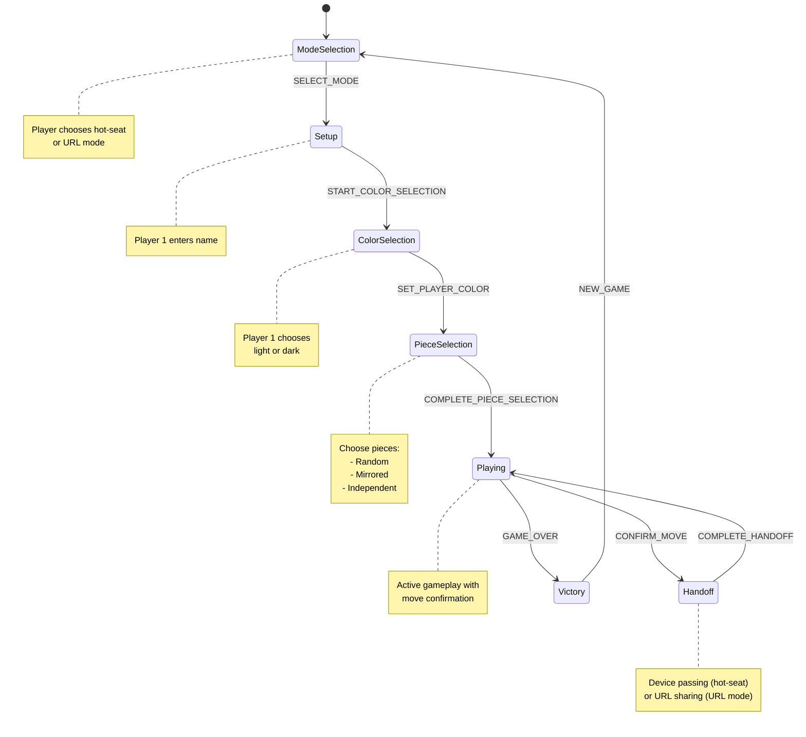

# King's Cooking Architecture

This document provides a comprehensive overview of the King's Cooking codebase architecture, focusing on state management, component structure, and phase flow.

## State Machine Overview

King's Cooking uses a **centralized state machine** implemented with React's `useReducer` hook.

### State Machine Diagram



### Phase Definitions

| Phase | Description | User Action | Next Phase |
|-------|-------------|-------------|------------|
| **mode-selection** | Choose game mode | Select hot-seat or URL | setup |
| **setup** | Player 1 name entry | Enter name, click Continue | color-selection |
| **color-selection** | Player 1 color choice | Choose light or dark | piece-selection |
| **piece-selection** | Choose starting pieces | Select mode and pieces | playing |
| **playing** | Active gameplay | Make moves | handoff or victory |
| **handoff** | Player transition | Click "I'm Ready" or share URL | playing |
| **victory** | Game end | View stats, click New Game | mode-selection |

### Action Types

| Action | From Phase | To Phase | Purpose |
|--------|-----------|----------|---------|
| `SELECT_MODE` | mode-selection | setup | Set game mode (hot-seat/URL) |
| `SET_PLAYER1_NAME` | setup | setup | Store Player 1 name |
| `START_COLOR_SELECTION` | setup | color-selection | Begin color selection |
| `SET_PLAYER_COLOR` | color-selection | piece-selection | Store Player 1 color choice |
| `START_PIECE_SELECTION` | color-selection | piece-selection | Begin piece selection |
| `SET_SELECTION_MODE` | piece-selection | piece-selection | Set mode (random/mirrored/independent) |
| `SET_PLAYER_PIECES` | piece-selection | piece-selection | Store player's pieces |
| `COMPLETE_PIECE_SELECTION` | piece-selection | playing | Create game state, start game |
| `SELECT_PIECE` | playing | playing | Show legal moves |
| `DESELECT_PIECE` | playing | playing | Clear selection |
| `STAGE_MOVE` | playing | playing | Prepare move for confirmation |
| `CONFIRM_MOVE` | playing | handoff/victory | Apply move to game state |
| `SET_PLAYER2_NAME` | handoff | handoff | Store Player 2 name |
| `COMPLETE_HANDOFF` | handoff | playing | Return to gameplay |
| `URL_GENERATED` | handoff | handoff | Update with generated URL |
| `GAME_OVER` | playing | victory | Game ends with winner |
| `NEW_GAME` | victory | mode-selection | Reset to start |
| `LOAD_FROM_URL` | any | playing | Load game from URL hash |

## Component Architecture

### File Organization

```
src/
├── components/game/           # Phase-specific screens and game UI
│   ├── ModeSelector.tsx       # Mode selection screen
│   ├── ColorSelectionScreen.tsx
│   ├── PieceSelectionScreen.tsx
│   ├── GameBoard.tsx          # Main game board
│   ├── HandoffScreen.tsx      # Privacy/transition screen
│   ├── Player2NameEntryScreen.tsx
│   ├── VictoryScreen.tsx
│   ├── PiecePickerModal.tsx   # Pawn promotion modal
│   ├── StoryPanel.tsx         # Story/instructions overlay
│   └── [other game components]
├── types/gameFlow.ts          # State machine types
├── lib/gameFlow/reducer.ts    # State machine logic
├── hooks/useUrlState.ts       # URL state synchronization
└── App.tsx                    # Main orchestrator
```

### Phase → Screen Mapping

| Phase | Screen Component | File Location | Props |
|-------|-----------------|---------------|-------|
| **mode-selection** | `ModeSelector` | `src/components/game/ModeSelector.tsx` | `onModeSelected` |
| **setup** | Inline JSX | `src/App.tsx:440-477` | - |
| **color-selection** | `ColorSelectionScreen` | `src/components/game/ColorSelectionScreen.tsx` | `player1Name`, `dispatch` |
| **piece-selection** | `PieceSelectionScreen` | `src/components/game/PieceSelectionScreen.tsx` | `state`, `dispatch` |
| **playing** | `GameBoard` + modals | `src/components/game/GameBoard.tsx` | `gameState`, `onMove`, etc. |
| **handoff** | `HandoffScreen` or `Player2NameEntryScreen` | See Handoff Logic below | Varies |
| **victory** | `VictoryScreen` | `src/components/game/VictoryScreen.tsx` | `winner`, `gameState`, etc. |

### Modal Registry

**Definition**: Modals are overlay components that appear conditionally, not tied to a specific phase.

| Modal Component | Trigger Condition | Purpose | Props |
|----------------|-------------------|---------|-------|
| `PiecePickerModal` | `pendingPromotion !== null` | Pawn promotion piece selection | `isOpen`, `availablePieces`, `onSelect`, `onClose` |
| `StoryPanel` | `showStoryPanel === true` | Display game story/instructions | `isOpen`, `onClose` |
| `HistoryComparisonModal` | Divergence detection | Resolve game state conflicts | `isOpen`, `onResolve`, etc. |

### Handoff Phase Logic

**Complex Conditional Rendering** (`src/App.tsx:827-1001`):

```typescript
if (state.phase === 'handoff') {
  if (state.mode === 'hotseat') {
    const needsPlayer2Name = !state.player2Name || state.player2Name.trim().length === 0;
    const comingFromMove = state.gameState !== null;

    if (needsPlayer2Name && comingFromMove) {
      if (!handoffStepCompleted) {
        // Step 1: Show HandoffScreen (privacy screen)
        return <HandoffScreen ... />;
      } else {
        // Step 2: Show Player2NameEntryScreen
        return <Player2NameEntryScreen dispatch={dispatch} />;
      }
    }

    // Normal handoff with both names known
    return <HandoffScreen ... />;
  } else {
    // URL mode
    const isPlayer2EnteringName = !state.generatedUrl;

    if (isPlayer2EnteringName) {
      // Player 2 receiving first URL, needs to enter name
      return <NameForm ... />;
    }

    // Player 1 sharing URL
    return <URLSharer ... />;
  }
}
```

## Local State Management

App.tsx uses **4 local useState hooks** in addition to the reducer:

| State Variable | Purpose | Initial Value | Usage |
|---------------|---------|---------------|-------|
| `showStoryPanel` | Story panel visibility | `false` | Controls `<StoryPanel isOpen={...} />` |
| `handoffStepCompleted` | Player 2 name collection tracking | `false` | Hot-seat two-step handoff flow |
| `historyIndex` | History navigation position | `null` | `null` = latest move, `number` = viewing past |
| `pendingPromotion` | Pawn promotion flow state | `null` | Stores move + engine for promotion modal |

## Data Flow

```
┌─────────────────────────────────────────────────────┐
│                    App.tsx                          │
│  ┌──────────────────────────────────────────────┐  │
│  │ useReducer(gameFlowReducer)                  │  │
│  │   state: GameFlowState (7 phases)            │  │
│  │   dispatch: Dispatch<GameFlowAction>         │  │
│  └──────────────────────────────────────────────┘  │
│                       ↓ props                       │
│  ┌──────────────────────────────────────────────┐  │
│  │ useState (local UI state)                     │  │
│  │   - showStoryPanel                           │  │
│  │   - handoffStepCompleted                     │  │
│  │   - historyIndex                             │  │
│  │   - pendingPromotion                         │  │
│  └──────────────────────────────────────────────┘  │
└─────────────────────────────────────────────────────┘
            ↓ props              ↓ props
┌───────────────────┐    ┌─────────────────────┐
│   GameBoard       │    │   HandoffScreen     │
│   (gameState,     │    │   (mode, names,     │
│    dispatch)      │    │    onContinue)      │
└───────────────────┘    └─────────────────────┘
        ↓                        ↓
┌───────────────────┐    ┌─────────────────────┐
│   localStorage    │    │   localStorage      │
│   (persistence)   │    │   (persistence)     │
└───────────────────┘    └─────────────────────┘
```

## Testing Strategy

### Test Coverage Requirements

- **Minimum**: 80% code coverage
- **Target**: 94%+ (current project average)
- **Critical Paths**: 100% coverage for state transitions

### Test Patterns

**Component Tests**:
```typescript
describe('ComponentName', () => {
  describe('Rendering', () => {
    it('should render with correct content', () => { ... });
  });

  describe('Interactions', () => {
    it('should call callback on action', () => { ... });
  });

  describe('Accessibility', () => {
    it('should have proper ARIA attributes', () => { ... });
  });
});
```

**Reducer Tests** (`src/lib/gameFlow/reducer.test.ts`):
- 71 tests covering all 17 actions
- 98%+ coverage
- Tests for invalid transitions
- Tests for edge cases

## Performance Considerations

### React 19 Compiler

- **No manual memoization** needed (`useMemo`, `useCallback`, `React.memo`)
- Write clean, readable code - let compiler optimize
- Focus on component composition over optimization tricks

### State Updates

- **Immutable updates** in reducer (return new state objects)
- **localStorage debouncing** (300ms) in NameForm
- **History reconstruction** uses memoization for expensive operations

## Future Refactoring Opportunities

1. **Split Handoff Phase**: Create separate phases for name entry vs. move transitions
2. **Modal Manager**: Centralized modal state management
3. **Phase Router**: Abstract phase rendering logic from App.tsx
4. **State Context**: Consider React Context for deeply nested prop drilling

## References

- **State Machine Types**: `src/types/gameFlow.ts`
- **Reducer Logic**: `src/lib/gameFlow/reducer.ts`
- **Component Patterns**: `claude_md_files/CLAUDE-REACT.md`
- **Testing Patterns**: `src/components/game/*.test.tsx`
