# Game Flow State Machine

Visual documentation of the game flow state machine for URL mode.

## State Diagram

```mermaid
stateDiagram-v2
    [*] --> ModeSelection

    ModeSelection: mode-selection
    note right of ModeSelection
        Starting point
        User chooses game mode
    end note

    ModeSelection --> Setup: SELECT_MODE(url)

    Setup: setup
    note right of Setup
        Data collected:
        - mode = 'url'
        - player1Name = null
    end note

    Setup --> ColorSelection: START_COLOR_SELECTION
    note left of ColorSelection
        player1Name entered
    end note

    ColorSelection: color-selection
    note right of ColorSelection
        Data collected:
        - player1Name
    end note

    ColorSelection --> PieceSelection: SET_PLAYER_COLOR
    note left of PieceSelection
        player1Color collected
    end note

    PieceSelection: piece-selection
    note right of PieceSelection
        Data collected:
        - player1Color (light/dark)
        - selectionMode (random/mirrored/independent)
        - player1Pieces [3 pieces]
        - player2Pieces (if random/mirrored)
    end note

    PieceSelection --> Handoff_P1Share: COMPLETE_PIECE_SELECTION
    note left of Handoff_P1Share
        Random/Mirrored + P1 Dark
        OR Independent mode (any color)
    end note

    PieceSelection --> Playing_P1First: COMPLETE_PIECE_SELECTION
    note right of Playing_P1First
        Random/Mirrored + P1 Light
        (P1 makes first move)
    end note

    Playing_P1First: playing (P1)
    note right of Playing_P1First
        Data:
        - gameState created
        - player2Name = ''
        P1 makes first move
    end note

    Playing_P1First --> Handoff_P1ShareMove: CONFIRM_MOVE
    note left of Handoff_P1ShareMove
        First move confirmed
        countdown = 0 (URL mode)
        player2Name = ''
        generatedUrl set by URL_GENERATED
    end note

    Handoff_P1Share: handoff (P1 shares initial URL)
    note right of Handoff_P1Share
        Data:
        - gameState (0 moves)
        - player2Name = ''
        - countdown = 0
        - generatedUrl set by URL_GENERATED
        Shows: URLSharer
    end note

    Handoff_P1ShareMove: handoff (P1 shares after move)
    note right of Handoff_P1ShareMove
        Data:
        - gameState (1+ moves)
        - player2Name = ''
        - countdown = 0
        - generatedUrl set by URL_GENERATED
        Shows: URLSharer
        Detection: generatedUrl exists
    end note

    Handoff_P1Share --> [*]: P1 copies URL
    Handoff_P1ShareMove --> [*]: P1 copies URL

    [*] --> Handoff_P2Name: P2 opens URL
    note right of Handoff_P2Name
        LOAD_FROM_URL action
        myName not in localStorage
    end note

    Handoff_P2Name: handoff (P2 enters name)
    note right of Handoff_P2Name
        Data from URL:
        - gameState
        - player1Name
        - player2Name = ''
        - countdown = 0
        - generatedUrl = null (key!)
        Shows: Player2NameEntryScreen
        Form pre-fills from localStorage
        Detection: !generatedUrl
    end note

    Handoff_P2Name --> PieceSelection_P2: COMPLETE_HANDOFF
    note left of PieceSelection_P2
        Independent mode only
        isIncompleteBoard = true
    end note

    Handoff_P2Name --> Playing_P2: COMPLETE_HANDOFF
    note right of Playing_P2
        Random/Mirrored mode
        Board complete
    end note

    PieceSelection_P2: piece-selection (P2)
    note right of PieceSelection_P2
        Data:
        - player2Name entered
        - gameState (incomplete)
        P2 picks pieces
    end note

    PieceSelection_P2 --> Handoff_P2Share: COMPLETE_PIECE_SELECTION
    note left of Handoff_P2Share
        P1 Dark (P2 is light)
    end note

    PieceSelection_P2 --> Playing_P2Move: COMPLETE_PIECE_SELECTION
    note right of Playing_P2Move
        P1 Light (P2 is dark)
    end note

    Playing_P2: playing (P2 after name)
    note right of Playing_P2
        Data:
        - player2Name set
        - gameState complete
        P2 sees P1's move
    end note

    Playing_P2Move: playing (P2 makes move)
    note right of Playing_P2Move
        Data:
        - Board now complete
        P2 makes first move
    end note

    Handoff_P2Share: handoff (P2 shares to P1)
    note right of Handoff_P2Share
        P2 shares URL back to P1
        Shows: URLSharer
        generatedUrl set by URL_GENERATED
    end note

    Playing_P2 --> Handoff_Normal: CONFIRM_MOVE
    Playing_P2Move --> Handoff_Normal: CONFIRM_MOVE

    Handoff_Normal: handoff (normal turn flow)
    note right of Handoff_Normal
        After subsequent moves
        Both players named
        countdown = 0 (URL mode)
        generatedUrl set by URL_GENERATED
        Shows: URLSharer
    end note

    Handoff_Normal --> [*]: Player copies URL

    [*] --> Playing_Return: LOAD_FROM_URL (returning)
    note left of Playing_Return
        myName matches a player
        Direct to playing phase
    end note

    Playing_Return: playing (returning player)
    note right of Playing_Return
        Player returns to game
        Direct to playing phase
    end note

    Playing_P2 --> Victory: GAME_OVER
    Playing_Return --> Victory: GAME_OVER

    Victory: victory
    note right of Victory
        Game ended
        Shows: VictoryScreen
    end note

    Victory --> [*]
```



## Key Detection Logic

### P1 vs P2 in Handoff Phase (URL Mode)

**P1 Sharing Move (shows URLSharer):**
```typescript
// App.tsx line 928
const isPlayer2EnteringName = !state.generatedUrl;

if (!isPlayer2EnteringName) {
  // P1 has generatedUrl → show URLSharer
  return <URLSharer url={state.generatedUrl || getShareUrl()} />;
}
```

**P2 Entering Name (shows name form):**
```typescript
// App.tsx line 928
const isPlayer2EnteringName = !state.generatedUrl;

if (isPlayer2EnteringName) {
  // P2 has generatedUrl = null → show name form
  return <Player2NameEntryScreen />;
}
```

### First Load vs Returning Player

**P2 First Load (shows name form):**
```typescript
// reducer.ts line 150-161
if (!myName) {
  // No saved name in localStorage → go to handoff for name entry
  return {
    phase: 'handoff',
    mode: 'url',
    player1Name,
    player2Name: '',  // Empty triggers name collection
    gameState: payload.gameState,
    lastMove: { from: [0, 0], to: [0, 1] },  // Placeholder
    countdown: 0,
    generatedUrl: null,  // P2 doesn't generate URL yet
  };
}
```

**Returning Player (skip name form):**
```typescript
// reducer.ts line 123-136
if (myName === player1Name) {
  // Player 1 returning → go directly to playing
  return {
    phase: 'playing',
    mode: 'url',
    player1Name,
    player2Name,
    gameState: payload.gameState,
    selectedPosition: null,
    legalMoves: [],
    pendingMove: null,
  };
} else {
  // Player 2 with saved name → go directly to playing
  return {
    phase: 'playing',
    mode: 'url',
    player1Name,
    player2Name: myName,
    gameState: payload.gameState,
    selectedPosition: null,
    legalMoves: [],
    pendingMove: null,
  };
}
```

## Data Flow by Scenario

### Scenario 1: Random + P1 Light

1. **piece-selection** → **playing** (P1)
   - Creates gameState with both players' pieces
   - player2Name = ''

2. **playing** → **handoff** (P1 shares move)
   - P1 makes first move
   - URL_GENERATED action sets generatedUrl
   - Shows URLSharer

3. **LOAD_FROM_URL** → **handoff** (P2 name)
   - player2Name = ''
   - generatedUrl = null (from reducer)
   - Shows name form

4. **handoff** → **playing** (P2)
   - player2Name entered
   - P2 sees board with P1's move

### Scenario 2: Random + P1 Dark

1. **piece-selection** → **handoff** (P1 shares initial)
   - Creates gameState with both pieces
   - player2Name = ''
   - currentTurn = 0
   - URL_GENERATED sets generatedUrl
   - Shows URLSharer

2. **LOAD_FROM_URL** → **handoff** (P2 name)
   - generatedUrl = null
   - Shows name form

3. **handoff** → **playing** (P2)
   - P2 is light, makes first move

### Scenario 3: Independent + P1 Light

1. **piece-selection** → **handoff** (P1 shares partial)
   - Incomplete board (only P1 pieces)
   - player2Name = ''
   - generatedUrl set by URL_GENERATED
   - Shows URLSharer

2. **LOAD_FROM_URL** → **handoff** (P2 name)
   - generatedUrl = null
   - isIncompleteBoard = true
   - Shows name form

3. **handoff** → **piece-selection** (P2 picks)
   - P2 enters name, picks pieces

4. **piece-selection** → **handoff** (P2 shares complete)
   - Board now complete
   - URL_GENERATED sets generatedUrl
   - P2 shares URL back to P1

5. **LOAD_FROM_URL** → **playing** (P1)
   - P1 sees complete board, makes first move

## Storage Keys

### URL Mode
- **Player 1**: `my-name` (localStorage) - entered during setup
- **Player 2**: `my-name` (localStorage) - entered from URL handoff with storageKey="my-name"

### Hot-Seat Mode
- **Player 1**: `player1` (localStorage)
- **Player 2**: `player2` (localStorage)

## State Shape Reference

```typescript
// HandoffPhase for P1 sharing move (AFTER URL_GENERATED)
{
  phase: 'handoff',
  mode: 'url',
  player1Name: 'Ryan',
  player2Name: '',  // Empty until P2 enters name
  gameState: GameState,  // After P1's move
  lastMove: { from: [0, 0], to: [1, 0] },  // From CONFIRM_MOVE
  countdown: 0,  // URL mode (no countdown)
  generatedUrl: 'https://...'  // Set by URL_GENERATED action
}

// HandoffPhase for P2 entering name (from LOAD_FROM_URL)
{
  phase: 'handoff',
  mode: 'url',
  player1Name: 'Ryan',
  player2Name: '',  // Empty triggers name form
  gameState: GameState,  // From URL
  lastMove: { from: [0, 0], to: [0, 1] },  // Placeholder from reducer
  countdown: 0,
  generatedUrl: null  // KEY DIFFERENCE: null for P2, URL for P1
}
```

## Critical Implementation Details

### Why `generatedUrl` Instead of `lastMove`?

The `lastMove` field is **unreliable** for P1/P2 detection because:
- Both P1 and P2 can have `lastMove` (P1 from CONFIRM_MOVE, P2 from reducer placeholder)
- `lastMove` presence doesn't guarantee which player is viewing

The `generatedUrl` field is **reliable** because:
- **P1**: Gets `generatedUrl` set by URL_GENERATED action after confirming move
- **P2**: Gets `generatedUrl = null` from reducer's LOAD_FROM_URL handler
- This is a **guaranteed distinction** set by the state machine

### Code References

**Detection in App.tsx:**
```typescript
// src/App.tsx:928
const isPlayer2EnteringName = !state.generatedUrl;
```

**P2 State Creation in reducer.ts:**
```typescript
// src/lib/gameFlow/reducer.ts:160
generatedUrl: null,  // Player 2 doesn't generate URL yet
```

**P1 URL Generation in reducer.ts:**
```typescript
// src/lib/gameFlow/reducer.ts:508
generatedUrl: null,  // URL mode: will be set by URL_GENERATED action
```

**URL_GENERATED Action Handler:**
```typescript
// src/lib/gameFlow/reducer.ts:574-577
case 'URL_GENERATED':
  // URL mode only
  if (state.phase !== 'handoff' || state.mode !== 'url') return state;
  return { ...state, generatedUrl: action.url };
```
