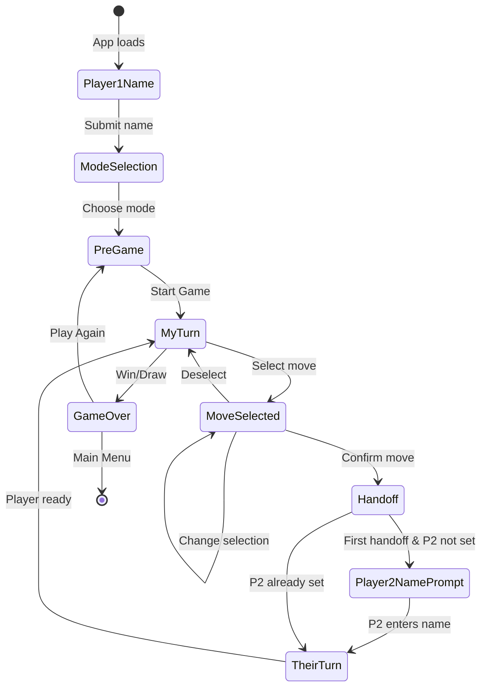

# State Diagram Template

This template provides the standard structure for documenting game states in the Correspondence Games Framework.

## Overview

Every correspondence game should use a **unified flow** with **mode-specific UI differences**.

**Key Principle:** Hot-Seat and URL modes share the same state flow, but display different UI elements in certain states.

**Why Unified Flow?**
- ✅ Simpler architecture - one flow to maintain
- ✅ Shared code between modes
- ✅ Easier to understand and debug
- ✅ Consistent player experience
- ✅ Mode differences are just UI, not logic

---

## Document Structure

Your `STATE_DIAGRAMS.md` file should have this structure:

```markdown
# [Game Name] State Diagrams

Brief description of the game.

## Unified Game Flow

[Single Mermaid diagram showing complete flow]

## State Details

[Documentation for each state with UI differences noted]

## UI Differences Between Modes

[Table showing mode-specific UI elements]

## Testing Checklist

[Test scenarios for both modes]
```

---

## Unified Flow Diagram Template



---

## State Details

### State: Player1Name

**Condition**: `player1Name === null` (app first loads)

**Purpose**: Collect player 1's name

**Display**:
- Header: "[Game Title]"
- Form label: "Enter your name:"
- Input field (pre-filled from `localStorage['my-name']` if exists)
- Button: "Continue"

**Both Modes**: Same UI (no mode chosen yet)

**Transitions**:
- Submit form → Save name to `localStorage['my-name']`, go to `ModeSelection`

**Implementation Notes**:
- Input should be `autoFocus`, `required`, `maxLength={20}`
- Use framework form classes (`.cg-form`, `.cg-form-input`)

---

### State: ModeSelection

**Condition**: `player1Name !== null && gameMode === null`

**Purpose**: Let player choose game mode

**Display**:
- Header: "Hi [name]! Choose mode:"
- Two clickable cards/buttons:
  - **Hot-Seat Mode**
    - Description: "Play with someone on this device"
  - **URL Mode**
    - Description: "Share game via URL to play remotely"

**Both Modes**: Same UI (choosing mode)

**Transitions**:
- Click Hot-Seat → Set `gameMode = 'hotseat'`, go to `PreGame`
- Click URL Mode → Set `gameMode = 'url'`, go to `PreGame`

**Implementation Notes**:
- No pre-selection (user must choose)
- Cards should be large, easy to tap
- No warnings on this screen

---

### State: PreGame

**Condition**: `gameMode !== null && gameState === null`

**Purpose**: Ready to start, show game info

**Display** (both modes):
- Header: "[Game Title]"
- Sub-header: "[Mode Name] Mode"
- "You: [name]"
- Button: "Start Game"
- Button: "Main Menu"

**Mode Difference**:
- **URL Mode Only**: Show warning message
  - "⚠️ Don't clear browser memory during game"

**Transitions**:
- Click "Start Game" → Create initial game state, go to `MyTurn`
- Click "Main Menu" → Reset, go to `Player1Name`

**Implementation Notes**:
- Only show P1's name (P2 not collected yet)
- Warning only visible in URL mode

---

### State: MyTurn

**Condition**: `gameState !== null && currentPlayer === myPlayerNumber && !moveSelected`

**Purpose**: Active player's turn, waiting for move selection

**Display**:
- Header: "[Game Title]"
- "You: [name]"
- Game board (interactive)
- Status: "Your turn - select a move"

**Both Modes**: Same UI

**Transitions**:
- Click cell → Set `selectedCell`, go to `MoveSelected`
- Game ends (external event) → go to `GameOver`

**Implementation Notes**:
- Board cells are clickable
- Current game state displayed
- No confirm button yet

---

### State: MoveSelected

**Condition**: `selectedCell !== null`

**Purpose**: Player selected a move, can confirm or change

**Display**:
- Header: "[Game Title]"
- "You: [name]"
- Game board (interactive)
- Selected cell highlighted/previewed
- Confirm button appears

**Mode Difference** (button text only):
- **Hot-Seat**: "Confirm & Hand Off"
- **URL Mode**: "Confirm & Generate URL"

**Transitions**:
- Click different cell → Change `selectedCell`, stay in `MoveSelected`
- Click same cell → Clear `selectedCell`, go to `MyTurn`
- Click confirm button → Apply move, go to `Handoff`

**Implementation Notes**:
- Selected cell should have distinct visual style
- Can show preview of X/O/piece in the cell
- Confirm button only appears when cell selected
- NO URL generation until confirmed

---

### State: Handoff

**Condition**: Move just confirmed, need to pass turn

**Purpose**: Show move confirmation and prepare for next player

**Display** (common):
- Shows the move that was just made
- Shows whose turn is next

**Mode Differences**:

**Hot-Seat Mode**:
- Header: "📱 Pass to [Player 2 name or 'Player 2']"
- Message: "[Player 2], it's your turn!"
- Shows last move made
- Automatically proceeds after brief moment OR needs click

**URL Mode**:
- Header: "📤 Share this URL"
- Shows last move made
- URL display (just generated)
- "Copy URL" button
- Message: "Send to [Player 2 name or 'Player 2']"
- Automatically proceeds to `TheirTurn`

**Transitions**:
- If `player2Name === null` → go to `Player2NamePrompt`
- If `player2Name !== null` → go to `TheirTurn`

**Implementation Notes**:
- **URL Mode**: URL generated here after move confirmed
- **Hot-Seat**: Brief pause or button click to proceed
- First handoff triggers P2 name prompt

---

### State: Player2NamePrompt

**Condition**: First handoff and `player2Name === null`

**Purpose**: Collect player 2's name on their first turn

**Display**:
- Header: "[Game Title]"
- Sub-header: "Player 2, enter your name:"
- Form with input field
- Button: "Continue"

**Mode Difference**:
- **Hot-Seat**: No warning
- **URL Mode**: Show warning
  - "⚠️ Don't clear browser memory during game"

**Transitions**:
- Submit form → Save name, go to `TheirTurn`

**Implementation Notes**:
- Same form style as Player1Name
- Use framework form classes
- **Hot-Seat**: Store in `localStorage['player2-name']`
- **URL Mode**: Store in `localStorage['my-name']` (it's their game now)

---

### State: TheirTurn

**Condition**: `currentPlayer !== myPlayerNumber` (waiting for other player)

**Purpose**: Waiting for opponent to make their move

**Display** (common):
- Header: "[Game Title]"
- "You: [name]"
- Game board (read-only, shows current state)
- Status message

**Mode Differences**:

**Hot-Seat Mode**:
- Message: "It's [Player 2]'s turn"
- Button: "I'm Ready" (P2 clicks when they have device)

**URL Mode**:
- Message: "⏳ Waiting for [Player 2]..."
- No button (passive waiting)
- Updates when URL is loaded

**Transitions**:
- **Hot-Seat**: Click "I'm Ready" → go to `MyTurn`
- **URL Mode**: Load URL with new move → go to `MyTurn`
- Game ends (external event) → go to `GameOver`

**Implementation Notes**:
- Board is not interactive
- Shows opponent's name if available
- URL mode: no user action needed

---

### State: GameOver

**Condition**: `status !== 'playing'` (win or draw)

**Purpose**: Show final results

**Display**:
- Header: "[Game Title]"
- Game board showing final state
- Result message:
  - "🎉 [Winner name] Wins!"
  - "🤝 It's a Draw!"
- Winning pattern (if applicable)
- Button: "Play Again"
- Button: "Main Menu"

**Both Modes**: Same UI

**Mode Difference**:
- **URL Mode**: NO "Share URL" section (game is over)

**Transitions**:
- Click "Play Again" → Clear game state, go to `PreGame`
- Click "Main Menu" → Reset everything, go to `Player1Name`

**Implementation Notes**:
- Highlight winning cells/pattern if applicable
- Use game state player names (not React state) for accuracy

---

## UI Differences Summary

| State | Hot-Seat UI | URL Mode UI |
|-------|------------|-------------|
| **Player1Name** | Standard form | Standard form (same) |
| **ModeSelection** | Option card | Option card (same) |
| **PreGame** | No warning | ⚠️ Browser memory warning |
| **MyTurn** | Same board | Same board (identical) |
| **MoveSelected** | "Confirm & Hand Off" | "Confirm & Generate URL" |
| **Handoff** | "Pass to Player 2" message | Share URL section + Copy button |
| **Player2NamePrompt** | No warning | ⚠️ Browser memory warning |
| **TheirTurn** | "I'm Ready" button | "⏳ Waiting..." (passive) |
| **GameOver** | Same | Same (no URL section) |

---

## State Variables Reference

### React State

```typescript
// Player identity
player1Name: string | null          // React state for UI
player2Name: string | null          // React state for UI (hot-seat) or null (URL)
myPlayerNumber: 1 | 2 | null       // URL mode: which player am I
myPlayerId: string                  // URL mode: persistent UUID

// Game state
gameMode: 'hotseat' | 'url' | null
gameState: GameState | null
selectedCell: number | null         // Move selection state
shareUrl: string                    // URL mode: generated share link
```

### Game State (Persisted)

```typescript
{
  gameId: string                    // UUID
  // Game-specific fields (board, pieces, etc.)
  currentTurn: number               // Increments each move
  currentPlayer: 1 | 2              // Whose turn
  player1: { id: string, name: string }
  player2: { id: string, name: string }
  status: 'playing' | 'player1_wins' | 'player2_wins' | 'draw'
  checksum: string                  // For validation
}
```

### localStorage Keys

**Both Modes:**
- `correspondence-games:my-name` - Current player's name
- `correspondence-games:my-player-id` - Persistent UUID
- `[game-name]:game-state` - Serialized game state

**Hot-Seat Mode Only:**
- `correspondence-games:player1-name` - Player 1's specific name
- `correspondence-games:player2-name` - Player 2's specific name

---

## Critical Implementation Patterns

### Move Selection & Confirmation

```typescript
const [selectedCell, setSelectedCell] = useState<number | null>(null);

const handleCellClick = (index: number) => {
  // Can't select if not my turn
  if (gameState.currentPlayer !== myPlayerNumber) return;

  // Toggle selection
  if (selectedCell === index) {
    setSelectedCell(null); // Deselect
  } else {
    setSelectedCell(index); // Select or change
  }
};

const handleConfirm = async () => {
  if (selectedCell === null) return;

  // Apply move to game state
  const newGameState = applyMove(gameState, selectedCell);

  // Generate URL only in URL mode, only after confirmation
  if (gameMode === 'url') {
    const url = await generateURL(newGameState);
    setShareUrl(url);
  }

  // Clear selection and update game
  setSelectedCell(null);
  setGameState(newGameState);
  // Transition to handoff
};
```

### P2 Name Collection Timing

```typescript
// Check on handoff
if (player2Name === null && gameState.currentTurn === 1) {
  // Show Player2NamePrompt
  return <Player2NameForm />;
}
```

### Mode-Specific UI

```typescript
// Confirm button text
const confirmText = gameMode === 'hotseat'
  ? 'Confirm & Hand Off'
  : 'Confirm & Generate URL';

// Handoff UI
if (gameMode === 'hotseat') {
  return <PassDeviceScreen />;
} else {
  return <ShareURLScreen url={shareUrl} />;
}
```

---

## Common Pitfalls

### ❌ Generating URL Too Early

**Wrong:**
```typescript
// URL generates on cell click
const handleCellClick = (index: number) => {
  setSelectedCell(index);
  const url = generateURL(gameState); // TOO EARLY!
  setShareUrl(url);
};
```

**Correct:**
```typescript
// URL generates only on confirm
const handleConfirm = async () => {
  const newState = applyMove(gameState, selectedCell);
  if (gameMode === 'url') {
    const url = await generateURL(newState); // After move applied
    setShareUrl(url);
  }
};
```

### ❌ Collecting Both Names Upfront

**Wrong:** Player 1 name → Player 2 name → Mode selection → PreGame

**Correct:** Player 1 name → Mode selection → PreGame → Play → P2 name on first handoff

### ❌ Different Flows for Each Mode

**Wrong:** Separate state machines for hot-seat vs URL

**Correct:** Single unified flow with UI variations

### ❌ Wrong localStorage Keys

**Hot-Seat:** Both players use separate keys (`player1-name`, `player2-name`)
**URL:** Each player uses `my-name` (same person across games)

---

## Testing Checklist

### Both Modes - Core Flow

- [ ] Enter name → continues to mode selection
- [ ] Pre-filled name from localStorage works
- [ ] Can edit pre-filled name
- [ ] Choose mode → goes to pre-game
- [ ] Pre-game shows correct info
- [ ] Start game → board appears
- [ ] Can select a cell
- [ ] Selected cell is highlighted
- [ ] Can change selection by clicking different cell
- [ ] Can deselect by clicking same cell
- [ ] Confirm button appears when cell selected
- [ ] Confirm button text matches mode
- [ ] Move applies after confirm
- [ ] P2 name prompt appears on first handoff
- [ ] Can continue game after P2 enters name
- [ ] Win condition detected correctly
- [ ] Draw condition detected correctly
- [ ] Game over shows correct result
- [ ] Play Again returns to pre-game
- [ ] Main Menu resets everything

### Hot-Seat Mode Specific

- [ ] No warnings shown
- [ ] Handoff shows "Pass to Player 2" message
- [ ] "I'm Ready" button works
- [ ] Alternates between players correctly
- [ ] Both player names persist in localStorage

### URL Mode Specific

- [ ] Warning shown in pre-game
- [ ] Warning shown in P2 name prompt
- [ ] No URL generated until move confirmed
- [ ] URL generated after confirm
- [ ] Copy URL button works
- [ ] Share URL section displays correctly
- [ ] Can load URL in new browser
- [ ] Delta encoding works for subsequent moves
- [ ] "Waiting..." message shows when not your turn
- [ ] localStorage cleared → error shown
- [ ] Invalid URL → error shown
- [ ] Player ID role switching works

### Edge Cases

- [ ] Loading URL before P2 joins (turn 1)
- [ ] Loading URL after P2 joined (turn 2+)
- [ ] Changing move after clicking confirm (should not work)
- [ ] Refreshing page mid-game
- [ ] Back button navigation
- [ ] Mobile responsive on all screens

---

## Visual Design Notes

### Move Selection Highlight

Recommended styling:
```css
.cell.selected {
  border: 3px solid var(--cg-color-primary);
  background: var(--cg-color-cell-hover);
  box-shadow: 0 0 10px rgba(0, 123, 255, 0.3);
}

@media (prefers-color-scheme: dark) {
  .cell.selected {
    border-color: var(--cg-color-primary-dark);
    background: var(--cg-color-cell-hover-dark);
    box-shadow: 0 0 10px rgba(74, 158, 255, 0.5);
  }
}
```

### Confirm Button

Should be prominent:
```css
.confirm-button {
  display: block;
  margin: 20px auto;
  padding: 15px 30px;
  font-size: 18px;
  /* Use framework button classes */
}
```

---

## Example Implementation

See these games for reference:
- **Tic-Tac-Toe:** `games/tic-tac-toe/src/App.tsx` (being updated to this pattern)
- **Emoji Chain:** `games/emoji-chain/src/App.tsx` (being updated to this pattern)

---

## Migration Guide

If updating an existing game with separate flows:

1. **Identify shared states** - Most states are probably already the same
2. **Extract UI differences** - Note where modes differ
3. **Consolidate logic** - Use `gameMode` checks for UI only
4. **Update state diagram** - Use unified template
5. **Test both modes** - Ensure nothing broke
6. **Update documentation** - Sync STATE_DIAGRAMS.md

---

## Template Checklist

When creating/updating state diagrams:

- [ ] Used unified flow diagram (not separate)
- [ ] Documented all states with conditions
- [ ] Noted UI differences for each state
- [ ] Included move selection/confirmation states
- [ ] P2 name collected on first handoff
- [ ] Listed React state variables
- [ ] Listed game state structure
- [ ] Listed localStorage keys
- [ ] Documented mode-specific UI elements
- [ ] Created testing checklist
- [ ] Verified diagram matches code

---

**Last Updated:** October 2025
**Version:** 2.0.0
**Framework Version:** 1.2.0
